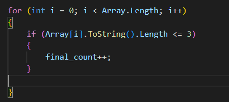
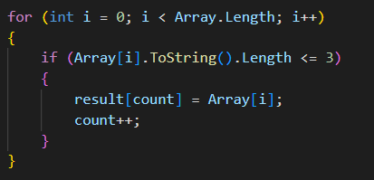

# Контрольная работа

## Блок-схема

## Описание решения

1. Задаём массив __*array*__, в котором содержаться строковые данные.
*string [] Array = {"Hello", "2", "World", ":-)"};*

2. Объявляем переменные __*int count*__ и __*int final_count*__ для подсчёта количества элементов, _*длина которых меньше либо равна 3*_.

3. Подсчитываем кол-во элементов <=3, используя цикл **for**. 

4. Задаём массив **result**, количество элементов которых равно ранее найденому количеству из *пункта 3*.

5. Заполняем массив result, используя цикл **for**. 